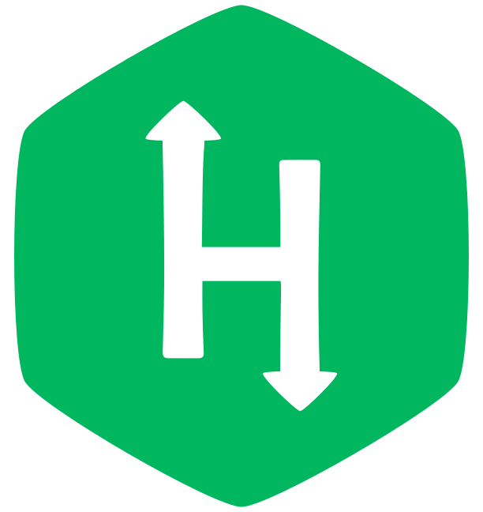

<h1 align="center"> Hey there! Vijay here 👋 </h1>

   Machine Learning | Data Science | Network Security | Competetive Programming | Problem Solving   

  

  

  

  

  

   
  
   

### Just another Machine learning, Data science enthusiast 💻 

  

### Languages 🚀

| | |   |  | | | | |
|:---:|:---:|:---:|:---:|:---:|:---:|:---:|:---:|

### Tools 🔥
| | | | | | | |
|:---:|:---:|:---:|:---:|:---:|:---:|:---:|